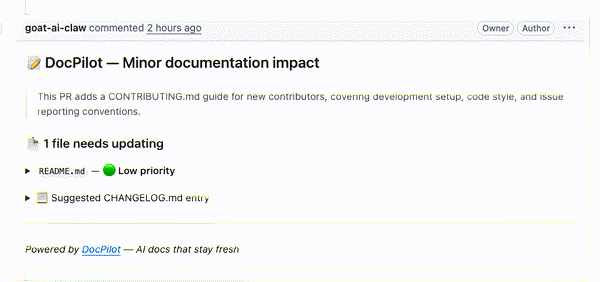
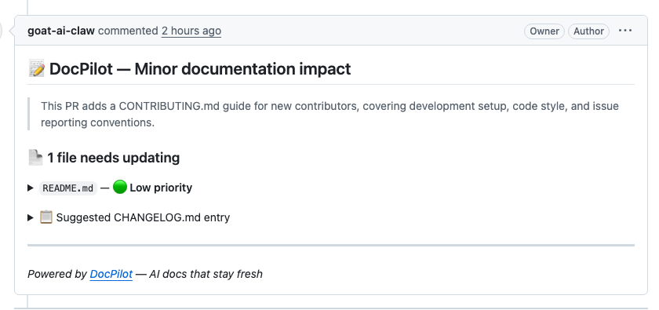

# DocPilot

[](https://github.com/goat-ai-claw/docpilot/actions/workflows/ci.yml) [](LICENSE) [](https://github.com/goat-ai-claw/docpilot/stargazers)

**Catch documentation drift before merge.**

DocPilot is a lightweight GitHub Action that checks pull requests for missing README, docs, and changelog updates — then drafts suggestions right in GitHub.

- **Purpose-built for docs drift** — not another generic AI review bot
- **Runs in your existing PR workflow** — no new platform, dashboard, or docs migration
- **Works with the docs you already have** — `README.md`, `docs/`, `CHANGELOG.md`, release notes
- **Cheap + transparent** — BYO OpenAI key, typically ~`$0.001–$0.005` per PR

## Why DocPilot

Documentation drift happens when code changes but the docs do not. A CLI flag gets renamed, a config key changes, a feature ships — and the README still describes the old behavior. Code review catches bugs; DocPilot catches docs debt before merge.

## See it in action

[](https://github.com/goat-ai-claw/docpilot/pull/1)

Animated walkthrough of a real [PR #1](https://github.com/goat-ai-claw/docpilot/pull/1) comment: DocPilot summarizes the documentation impact, flags the exact file that needs updating, and suggests a changelog entry.

[](https://github.com/goat-ai-claw/docpilot/pull/1)

## Quickstart

**Step 1** — Add your OpenAI key as a GitHub secret named `OPENAI_API_KEY`.

**Step 2** — Start with a read-only trial in `report` mode. Create `.github/workflows/docpilot.yml`:

```yaml
name: DocPilot

on:
  pull_request:
    types: [opened, synchronize, reopened]

jobs:
  docs:
    if: ${{ secrets.OPENAI_API_KEY != '' }}
    runs-on: ubuntu-latest
    permissions:
      contents: read
      pull-requests: read
    steps:
      - uses: actions/checkout@v4
      - uses: goat-ai-claw/docpilot@v1
        with:
          openai_api_key: ${{ secrets.OPENAI_API_KEY }}
          mode: report
```

This default setup keeps permissions narrow, skips safely when the OpenAI secret is unavailable, and lets teams evaluate DocPilot before granting write access.

**Step 3** — Open a pull request. In `report` mode, DocPilot writes a GitHub Actions step summary and sets outputs without posting PR comments or committing changes.

**Step 4** — When you want inline PR feedback, switch to `mode: suggest` and grant `pull-requests: write`.

> ⚠️ **DocPilot — Moderate documentation impact**
>
> Added a new `--timeout` flag to the CLI that isn't documented in README.md.
>
> 📄 **1 file needs updating**
> - `README.md` — 🔴 High priority

## Configuration

| Input | Default | Description |
|-------|---------|-------------|
| `openai_api_key` | — | **Required.** Your OpenAI API key. Store as a GitHub secret. |
| `github_token` | `github.token` | GitHub token for posting comments and reading PRs. |
| `model` | `gpt-4o-mini` | OpenAI model. Use `gpt-4o` for higher quality. |
| `doc_paths` | `README.md,docs/,CHANGELOG.md` | Comma-separated files or directories to analyze. Directories end with `/`. |
| `mode` | `suggest` | `report` writes a step summary only, `suggest` posts a PR comment, and `auto-update` commits suggestions to the PR branch. |
| `fail_on_impact` | — | Optional quality gate. Set to `minor`, `moderate`, or `major` to fail the workflow when DocPilot detects that impact level or higher. |
| `comment_on_no_impact` | `false` | When `true`, keeps an all-clear PR comment even if DocPilot finds no docs drift. Default is quiet mode. |

## Outputs

| Output | Description |
|--------|-------------|
| `impact` | `none`, `minor`, `moderate`, or `major` |
| `docs_updated` | Number of files flagged for updates |
| `summary` | One-line summary of the PR's documentation impact |

## Example: Suggest mode PR comments

```yaml
- uses: goat-ai-claw/docpilot@v1
  with:
    openai_api_key: ${{ secrets.OPENAI_API_KEY }}
    mode: suggest
```

Use `suggest` when you want inline PR comments. Grant `pull-requests: write` for this mode.

## Example: Gate merges on major doc impact

```yaml
- uses: goat-ai-claw/docpilot@v1
  id: docpilot
  with:
    openai_api_key: ${{ secrets.OPENAI_API_KEY }}
    fail_on_impact: major
```

`fail_on_impact` works in every mode, so teams can start in read-only `report` mode and still block merges when documentation drift is severe enough.

## Example: Auto-update mode

```yaml
- uses: goat-ai-claw/docpilot@v1
  with:
    openai_api_key: ${{ secrets.OPENAI_API_KEY }}
    mode: auto-update
    doc_paths: 'README.md,docs/'
```

For `auto-update`, add `contents: write` permission because DocPilot will commit changes back to the PR branch.

In `auto-update` mode, DocPilot commits suggestions directly to the PR branch wrapped in review markers. Authors merge, edit, or discard them as needed.

## Permissions and fork behavior

- `report` mode is read-only and works with `contents: read` + `pull-requests: read`
- `suggest` mode needs `pull-requests: write`
- `auto-update` mode needs `pull-requests: write` and `contents: write`
- DocPilot is quiet by default when impact is `none`; set `comment_on_no_impact: 'true'` if you want explicit all-clear comments on every PR
- On pull requests from forks, repository secrets like `OPENAI_API_KEY` are usually unavailable, so the recommended `if: ${{ secrets.OPENAI_API_KEY != '' }}` guard avoids noisy failures

## Privacy and limitations

- DocPilot sends pull request diffs and relevant documentation context to OpenAI for analysis
- Do not enable it on repositories where that data must never leave GitHub
- If the model returns malformed or incomplete structured output, DocPilot fails the run instead of quietly reporting `impact = none`, so broken analysis does not masquerade as "all clear"
- Like any LLM-powered reviewer, suggestions can be wrong — keep a human in the loop before merging doc changes

## Why not just use a code review bot or docs platform?

| Option | Best for | Tradeoff |
|--------|----------|----------|
| **DocPilot** | Catching docs drift inside normal PR review | Focused scope by design |
| Generic AI review bots | Broad code review across many issue types | Docs coverage is usually incidental, not the product |
| Docs platforms | Hosting / publishing / search / docs portals | Heavier adoption, migration, and subscription overhead |
| PR templates + manual review | Lightweight reminders | Easy to ignore, inconsistent in practice |

DocPilot is intentionally narrow: it answers one high-value question in every PR — **did this code change require a docs update?**

## Cost

DocPilot uses `gpt-4o-mini` by default. A typical PR analysis costs **~$0.001–$0.005** depending on diff and doc size.

## License

MIT © 2026 DocPilot Contributors
